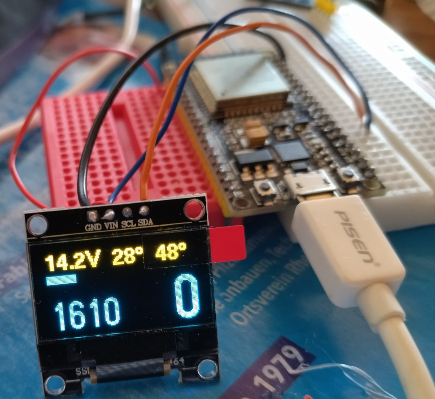
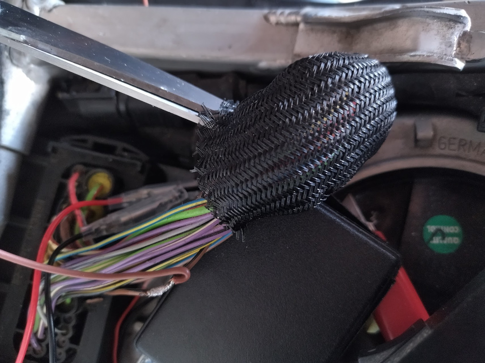

# Display for BMW G 650 and F 650 Single 2004-2014 motorcycles

This project reads rpm, speed, engine and intake temperature with an ELM327-compatible Bluetooth adapter and an ESP32 from the ECU. The data are shown on a SSD1306 0.96" 128×64 yellow/blue OLED display. It was tested with a G 650 Xchallenge, but the same ECU is used with [other BMW motorcyles](https://www.realoem.com/bmw/enUS/part?id=0176-EUR-04-2004-R13-BMW-F_650_GS_Dakar_04_0176,0186_&mg=13&sg=61&diagId=13_1119&q=13627714905).

## Future ideas

The current gear could be displayed (at the moment no more space in the display). For powering the ESP32 directly from the motorcycle, a cheap car USB charger could be opened and connected to VIN of ESP32.

# Used materials

- [SSD1306 0.96" 128×64 yellow/blue OLED display](https://www.amazon.com/Serial-Yellow-Display-SSD1306-Arduino/dp/B07KNTQ4R3)
- [ESP32 development board](https://www.aliexpress.com/item/1005003253018897.html)
- [ELM327-compatible OBD2 Bluetooth adapter with K-Line support](https://www.aliexpress.com/item/32876810879.html)
- [OBD2 female extension](https://www.aliexpress.com/item/32678512660.html)

# Connections
## Motorcycle
Connect the OBD2 Female extension to the motorcycle. For the assignment see [here](http://blog.obdii365.com/2016/02/16/bmw-motorcycle-10-pin-and-icom-d-pinout/). The K-Line on the G 650/F 650 Single 2004+ is a brown-black wire at the ECU plug or at the diagonstic plug. It must be connected to pin 7 of the OBD plug.

Here I have just removed 1cm of insulation without cutting the cable, twisted, soldered and insulated it with self-vulcanizable tape.

Pin 4 of the OBD plug must be connected to ground (e.g. minus of battery or a frame screw). Pin 16 must be connected to ignition plus (e.g. from tail light with relais and fuse). Check if the adapter is correctly working with the app [Motoscan](https://play.google.com/store/apps/details?id=de.wgsoft.motoscan).

## ESP32 and display

Connect VIN of display to 3V3 of ESP32, GND to GND, SCL to G16 and SDA to G17.

Other 128x64 displays can be used if the line starting with `U8G2_SSD1306_128X64_NONAME_F_SW_I2C` in the code is replaced with the corrected one for your display, see [here](https://github.com/olikraus/u8g2/wiki/u8g2setupcpp).

## Uploading code
Put the code [650Display.ino](650Display.ino) in a folder of the same name, install Arduino IDE with ESP32 and the libraries [U8g2](https://github.com/olikraus/u8g2/wiki/u8g2install) and [ELMduino](https://github.com/PowerBroker2/ELMduino).
Connect the ESP32, open the code file and configure the correct settings in "Tools". I have set "ESP32 DEV Module" as "Board" and the correct COM port found in device manager as "Port".

In the code, change the line beginning with `uint8_t BLUETOOTH_ADAPTER_ADDRESS` to your adapter's Bluetooth address. It can be found if you pair it with Windows and follow [this](https://www.addictivetips.com/windows-tips/find-bluetooth-mac-address-windows-10/) tutorial or in device manager.

The code can then be uploaded to ESP32. On some ESP32 boards one has to press the "boot" button during upload, normally it is not necessary.
